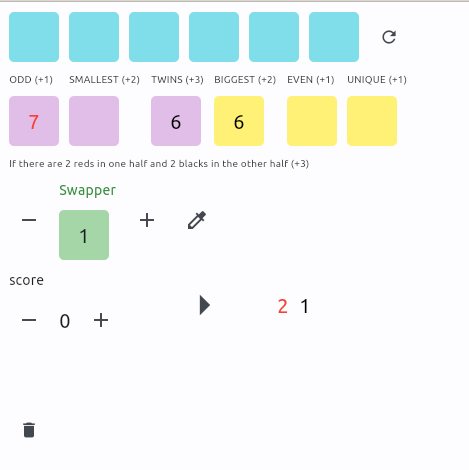

# DICE GAME IN FLET (PYTHON) 🎲🐍

This project uses the [Flet](https://flet.dev/) library. Flet enables developers to easily build realtime web, mobile and desktop apps in Python. No frontend experience required.

It's a game for 2 players. Each player will have the game running on their device.

The objective is to exchange one of the dice placed in the middle row with the other player each round. The exchange is mandatory in each round. If an agreement is not reached, a die from the middle row must be returned to the upper row and re-rolled. For each time this disagreement process is repeated, a greater number of dice must be re-rolled.

Finally, when all dice are placed in the middle row, the game is over. Points are counted following the instructions and added to your points tally. You can play as many games as you want to see which player accumulates the most points.